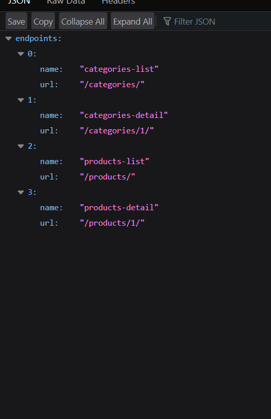
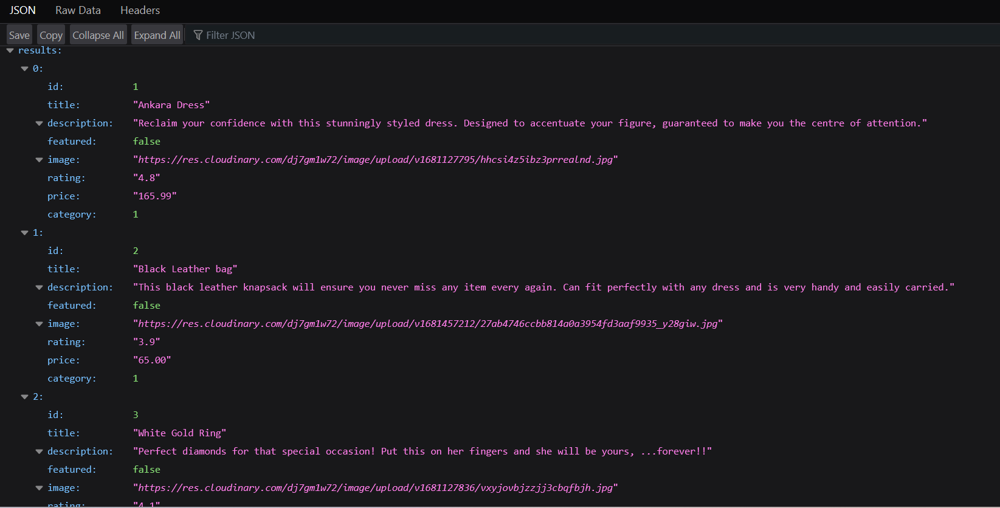
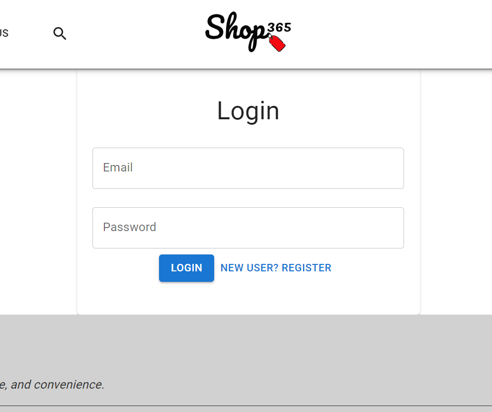
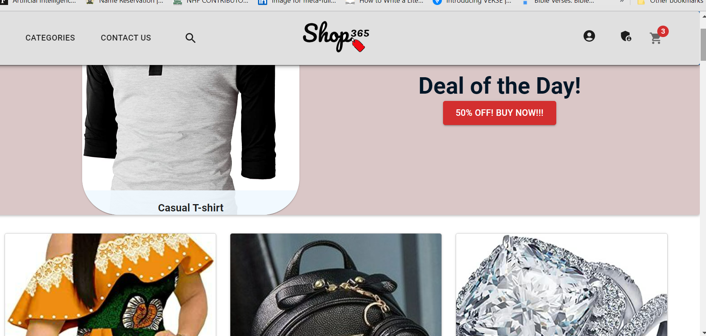
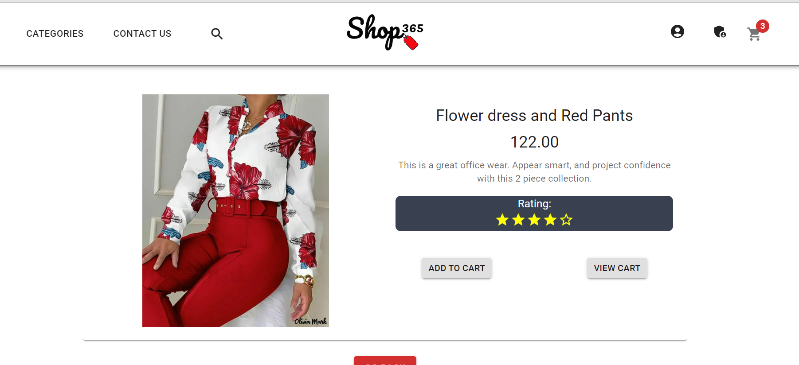
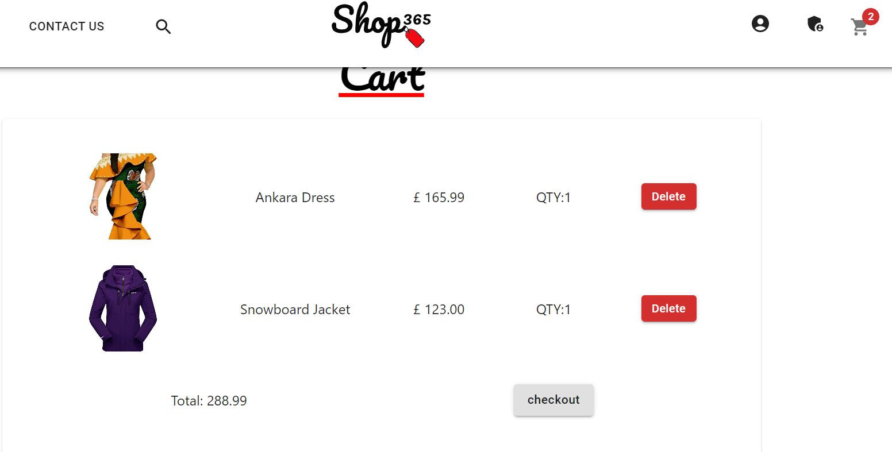
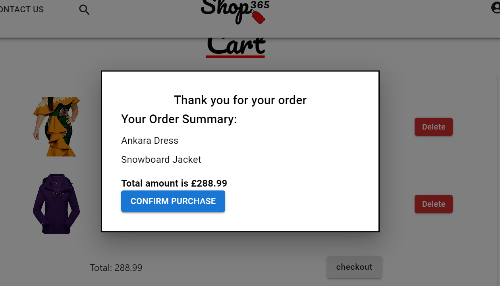
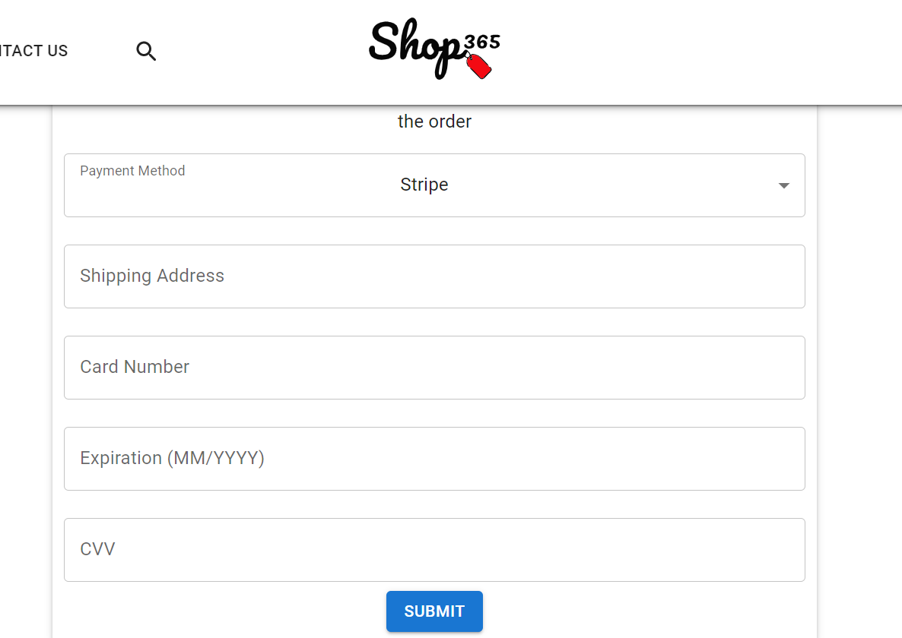

# EEKI


## Overview

This project is a fullstack ecommerce application which enables users carry out online shopping activities. The project consists of two sub applications, a django application which makes up the backend and a react application which makes up the frontend. The backend is a RESTful api which provides several endpoints which the frontend consumes for carrying out CRUD operations to the database server. The backend is deployed on an AWS EC2 instance, whilst the frontend is deployed on Betlify. This project is a spin-off from the shop365 project which extends that project.


## Table of Contents

* [About the Project](#about-the-project)

* [Deployment](#deployment)

* [Technologies](#technologies)

* [License](#license)

* [Screenshots](#screenshots)

* [Questions](#questions)

* [Acknowledgements](#acknowledgements)

## About the Project

* The Backend

The backend is built with the django rest framework and utilizes MYSQL database for information. This is an API which provides several endpoints that enables new users to register, old users to login and obtain access tokens,  create a cart, fetch all products, add products to their cart, update products in their cart, create an order on checkout, make payment for thier order.  Users are also able to search and filter products by category.
See below for a list of available endpoints:

* New User Registration [POST /auth/users]: Allows users to register for a new account.
* User Login and access token generation: [POST /auth/jwt/create]: Allows users to login and obtain an access token to use for authenticated API requests.
* Get a cart: [POST /cart]: Retrieves the specified cart for the authenticated user.
* Get all products: [GET /products]: Retrieves a list of all available products.
* Get a specific product: [GET /products/product-id]: Retrieves details for the specified product.
* Add products to cart:  [GET /cart/cart-id/items]: Adds one or more products to the specified cart.
* Remove or reduce the quantity of a product in the cart: [DELETE /cart/cart-id/items]: Removes one or more items from the specified cart or reduces the quantity of an item in the cart.
* Checkout and create an order: [POST /orders]: Initiates the checkout process and creates a new order.
* Update your order [PUT/PATCH /orders]: Allows users to update the details of an existing order.
* Pay for an order: [POST /payments]: Allows users to submit payment for an existing order.


___

* The Frontend

```
The frontend is built with react js, material ui, react-lazy-load and a host of other npm packages. It provides a graphical user interface for communicationg with the API. It consists of a Navbar, a featured product section, the products section, and the footer. Clicking on a button in the products section leads to the product detail page, where a user can add product to the cart. A user will have to register and be login to be able to get a cart and add items to their cart. When users are done with adding items to their cart, they can checkout, a popup appears with a summary of their order. Confirming their purchase creates an order and they are redirected to a payment page, where they can input their payment details to pay for the order. On submission of the form a payment confirmation page appears briefly before they redirected back to the homepage.
```


## Deployment

[](https://app.netlify.com/sites/eeki/deploys)


* The frontend is deployed on netlify. Visit the url on https://eeki.netlify.app

* The backend is deployed on AWS EC2 instance. Visit the url on https://shop365api.store and you will see a list of available endpoints.


## Technologies

Frontend
* React JS
* Material UI
* React-lazy-load
* React Router

Backend
* Django web and rest framework
* MYSQL DB
* JSON Web Token authentication

Tools used in Development
* Insomnia REST client

Deployment
* AWS EC2 instance
* Netlify

## License

* Project is licensed under <br/> .


## Screenshots


<div align="center">
    <div display="flex">
        <div display="flex" flex-direction="column">
            
            
            <p>Backend index and products endpoints </p>
        </div>
    <div display="flex" flex-direction="column">
        <div>
            
            
             
        </div>
        <p>User Login View, Homepage and ProductDetail Page</p>
        </div>
    </div>
    <div display="flex" flex-direction="column">
        <div>
            
            
            
        </div>
        <p>Cart View, OrderCreate Popup and Payments Page</p>
    </div>
</div>


## Questions

If you have any questions you can contact me via email at Zee: zeemudia@outlook.com

You can see more of my work on my github profile [Zee](https://github.com/iosazee).

## Acknowledgements
 First God, without whom we are nothing but dust.
 Stackoverflow and other internet sources for inspiration.


