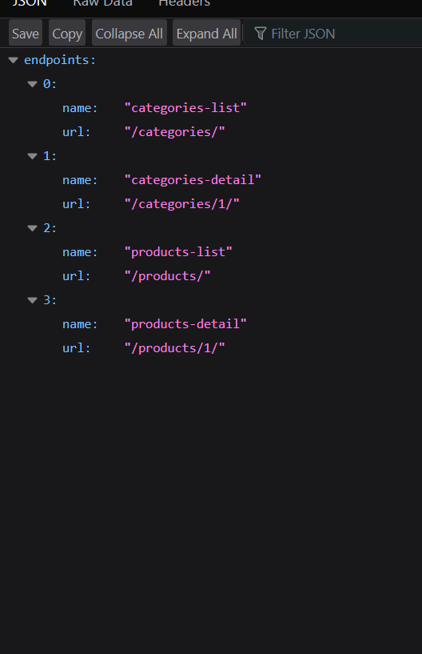
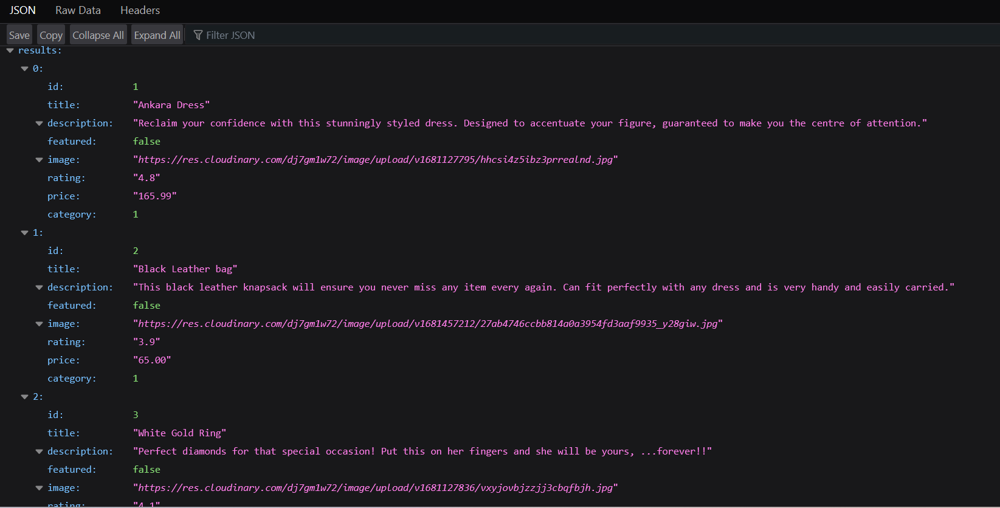
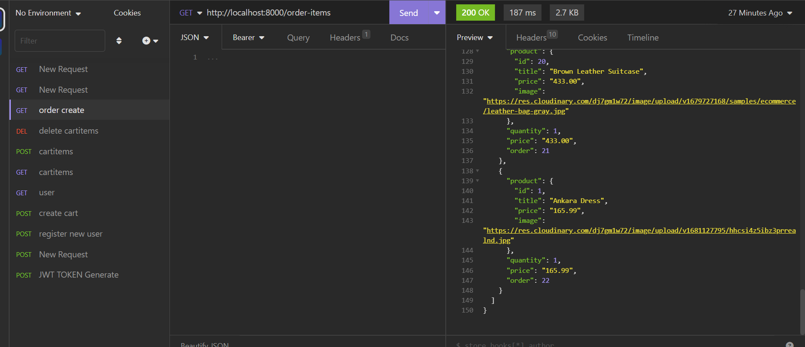

# SHOP365 API


## Overview

This application is a RESTful API which provides several endpoints for users to be able to carry out shopping online seamlessly. These endpoints enable users to carry out CRUD operations to the database. A frontend app can be built to utilise these endpoints and provide a graphical user interphase. Example is the [frontend](https://github.com/iosazee/eeki/tree/main/frontend) part of this project.


## Table of Contents

* [About the Project](#about-the-project)

* [Deployment](#deployment)

* [Technologies](#technologies)

* [License](#license)

* [Screenshots](#screenshots)

* [Questions](#questions)

* [Acknowledgements](#acknowledgements)

## About the Project

The app is built with the django rest framework and utilizes MYSQL database for information. This is an API which provides several endpoints that enables new users to register, old users to login and obtain access tokens,  create a cart, fetch all products, add products to their cart, update products in their cart, create an order on checkout, make payment for thier order.  Users are also able to search and filter products by category.

See below for a list of available endpoints:

* New User Registration [POST /auth/users]: Allows users to register for a new account.

* User Login and access token generation: [POST /auth/jwt/create]: Allows users to login and obtain an access token to use for authenticated API requests.

* Get a cart: [POST /cart]: Retrieves the specified cart for the authenticated user.

* Get all products: [GET /products]: Retrieves a list of all available products.

* Get a specific product: [GET /products/product-id]: Retrieves details for the specified product.

* Add products to cart:  [GET /cart/cart-id/items]: Adds one or more products to the specified cart.

* Remove or reduce the quantity of a product in the cart: [DELETE /cart/cart-id/items]: Removes one or more items from the specified cart or reduces the quantity of an item in the cart.

* Checkout and create an order: [POST /orders]: Initiates the checkout process and creates a new order.

* Update your order [PUT/PATCH /orders]: Allows users to update the details of an existing order.

* Get the Order for the authenticated user: [GET /orders]: Allow users to get their orders

* Pay for an order: [POST /payments]: Allows users to submit payment for an existing order.

* Get all the orderitems for a user: [GET /order-items] : Aloows users to view the products  contained in their orders.

* Get all categories [GET /categories]: Returns a list of categories in the database

Formating The Data

The response from the server will either be in the form of an XML or JSON response. You can specify which one in the request header or in the url like this
```sh
endpoint/?format=json
```


## Deployment


* The backend is deployed on AWS EC2 instance. The base url is https://shop365api.store


## Technologies

Backend
* Django web and rest framework
* MYSQL DB
* JSON Web Token authentication

Tools used in Development
* Insomnia REST client


## License

* Project is licensed under <br/> .


## Screenshots

<div align="center">
    <div display="flex">
        <div display="flex" flex-direction="column">
            
            
             
            <p>Index, products and order-items endpoints </p>
      </div>
    </div>
</div>


## Questions

If you have any questions you can contact me via email at Zee: zeemudia@outlook.com

You can see more of my work on my github profile [Zee](https://github.com/iosazee).

## Acknowledgements
 First God, without whom we are nothing but dust.
 Stackoverflow and other internet sources for inspiration.


